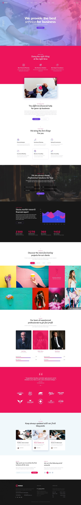

# HackerYou Intro to Web Dev/Advanced Web Dev Project - 2

This single-page site was built as part of the continuing education Intro to Web Development/Advanced Web Development programs at HackerYou. 

This project was completed April, 2019.

## Requirements
The project requiements were to create a functioning exact replica of a given client template image and font/colour specifications. The project was focused on using HTML/CSS to create a full web page (non-responsive).

## Screenshot of Requested Template
